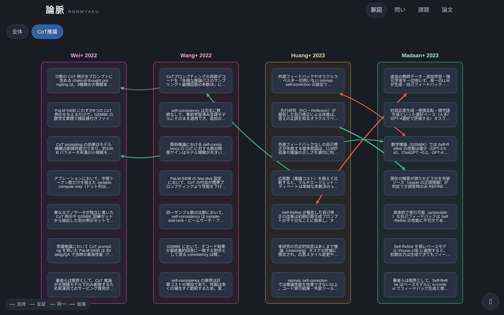
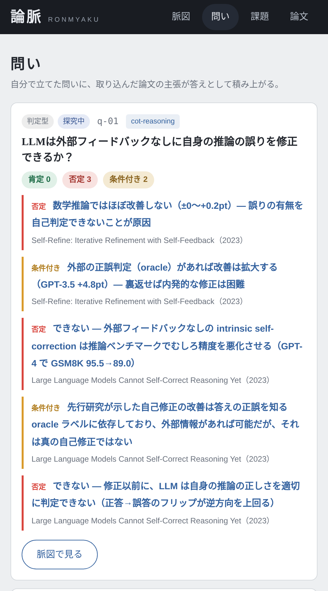
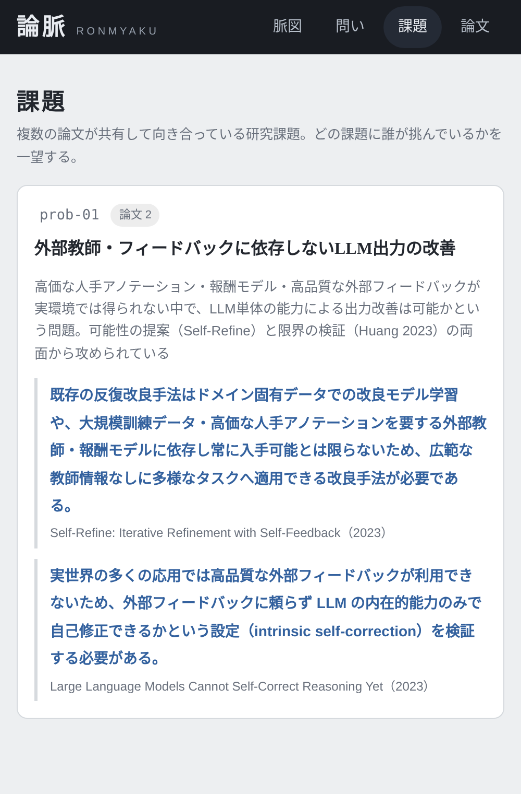
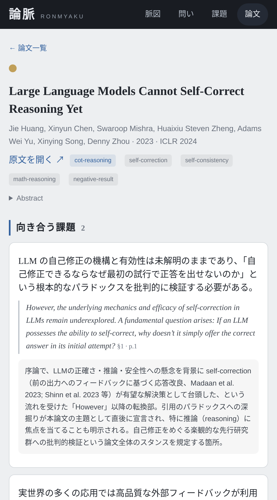

# 論脈 RONMYAKU

**論文の主張（クレーム）を複数論文横断で管理・紐付け・グラフ可視化する個人用リサーチツール。**

論文（主に arXiv）を Claude Code で取り込むと、主張が根拠・実験条件・原文引用つきで抽出され、既存の主張との関係（支持 / 反証 / 同一 / 拡張）が張られる。読み込ませるほど、あるトピックの研究状況 — どこにコンセンサスがあり、どこが係争中で、何が未検証か — が一望できるようになる。

*A personal research tool that extracts claims from papers (via Claude Code), links them across papers (supports / contradicts / same / extends), and visualizes the state of a research topic as a graph.*

## スクリーンショット

**脈図** — 論文カラム（左→右が時系列）に主張カードを配置。エッジの色: 緑=支持 / 赤=反証（両端矢印） / 青破線=同一 / 灰点線=拡張



| 問いダッシュボード | 課題 | 論文詳細 |
|---|---|---|
|  |  |  |

## コンセプト

- **抽出・照合・紐付けは Claude Code が行う**（`.claude/skills/` のプロジェクトスキル）。Web UI は閲覧・可視化専用
- **ストレージは JSON ファイル + git**。DB なし。Claude Code が直接読み書きでき、diff で履歴が追え、壊れたら戻せる
- **プロベナンス原則**: すべての主張・課題は原文引用（quote）・出典セクション・周辺文脈（context_ja）を必須で持ち、引用は PDF 本文との機械照合（`scripts/verify_quotes.py`）で捏造を検出する
- **4つの分類軸**: topic（分野の棚）/ tag（照合スコープ・ユーザー付与）/ 問い（ユーザーの探究。主張が答えとして自動蓄積）/ 課題（論文が向き合う研究課題。共有課題で論文同士が繋がる）

## 必要環境

- Python 3.11+ / [uv](https://docs.astral.sh/uv/)
- `pdftotext`（poppler-utils）— PDF 読解に使用
- [Claude Code](https://claude.com/claude-code) — 論文の取り込み・紐付けを行うエージェント

## セットアップ

```bash
git clone https://github.com/sara624-dev/paper_claims.git
cd paper_claims
uv sync
uv run uvicorn app.main:app --host 0.0.0.0 --port 8124
# → http://localhost:8124/ を開く
```

## 使い方

Claude Code をリポジトリのルートで起動すると、`.claude/skills/` のプロジェクトスキルが自動で使えるようになる。

### 1. 論文を取り込む

```
/paper-import https://arxiv.org/abs/2201.11903 cot-reasoning
/paper-import 2310.01798 cot-reasoning self-correction,math-reasoning
/paper-import ~/papers/foo.pdf
```

### 2. 問いを立てる

```
/paper-question "LLMは外部フィードバックなしに自身の推論の誤りを修正できるか？" cot-reasoning
```

**一度問いを立てると、以降の取り込みで答えとなる主張が自動でリンクされる**。

## スキルリファレンス

### `/paper-import <ソース> [topic-id] [タグ,タグ,...]`

論文1本を取り込み、課題・主張の抽出 → 既存主張との照合・関係判定 → 問いへの回答判定 → 検証 → コミットまで行う。

| 引数 | 必須 | 説明 |
|------|:---:|------|
| ソース | ✓ | arXiv URL（`https://arxiv.org/abs/2201.11903`）/ arXiv ID（`2201.11903`。`v3` 付きも可、バージョンは除去される）/ ローカル PDF パス |
| topic-id | – | 既存トピックの id（`data/topics.json`。例 `cot-reasoning`）。省略時は内容から既存トピックを自動選択し、合うものがなければ対話で新設する |
| タグ | – | カンマ区切り（例 `self-correction,math-reasoning`）。**省略時は論文読解後に既存語彙から候補が提示され、ユーザーが選択・追加する**（タグは照合スコープを決めるためユーザーが決定する設計） |

実行中に確認を求められるポイント（いずれもユーザー承認制）:
- **タグの確定**（引数で未指定の場合）
- **新規トピックの作成**（既存に合うものがない場合）
- **共有課題への紐付け**（既存論文と同じ課題に向き合っていると判定された場合。比較対象の原文引用・文脈が提示される）

会話ベースの派生操作:
- **追補**: 「`arxiv-2201.11903` に忠実性の観点でクレームを追補して」→ 指定観点で PDF を再読し、既存と重複しない主張を追加
- 取り込み済み論文を再度指定した場合は中断して報告される（上書きは明示指示があった場合のみ）

### `/paper-question "<問いの文面>" [topic-id]`

問いを登録し、既存の主張から答えを遡及マッピングする。

| 引数 | 必須 | 説明 |
|------|:---:|------|
| 問いの文面 | ✓ | 主張が直接答えられる粒度の問い。**判定型**（yes/no → 肯定/否定/条件付きの証拠が集計される）か**記述型**（what/how → 答えの候補が並ぶ）かは自動判定され、曖昧な場合は確認される |
| topic-id | – | 対象トピック（照合スコープ）。省略時は内容から選択・確認 |

会話ベースの派生操作:
- **ステータス変更**: 「`q-01` は決着にして」（settled）/「保留にして」（archived）/「再開して」（open）。open 以外の問いは以降の取り込みで回答判定の対象外になる
- 登録時、既存クレームに答えがなくても「答えていそうな論文」があれば PDF を問いの観点で再読して主張を追補する（抽出漏れの回復）

### 3. 見る

| URL | 内容 |
|-----|------|
| `/` | 脈図（主張グラフ）。トピック切替、`?question=q-01` で問いレンズ（stance で枠色） |
| `/questions` | 問いダッシュボード（肯定N・否定N・条件付きN + 証拠一覧） |
| `/problems` | 共有課題（どの課題に誰が挑んでいるか） |
| `/papers` | 論文一覧・詳細（課題・主張・関係） |

### 4. データの検証

```bash
bash scripts/check.sh                        # lint / 型 / テスト / スキーマ・参照整合性
uv run python scripts/verify_quotes.py       # 全引用の PDF 照合（捏造検出）
uv run python scripts/build_index.py         # 照合用インデックス再生成
```

## データスキーマ

`data/` 配下の JSON が全データ（スキーマの正は `app/models.py`、詳細表は `CLAUDE.md`）。論文1件=1ファイル、関係・問い・課題は台帳ファイル。手編集した場合は validate と build_index を必ず実行する。

## 常駐化（任意）

LAN 内サーバ（Raspberry Pi 等）で常時稼働させる場合は `paper-claims.service` を編集して systemd に登録する（手順はファイル内コメント）。**認証は持たないため、信頼できるネットワーク内でのみ公開すること。**

## 設計原則

- 「壊れない」ではなく「**壊れても静かに腐らない**」: スキーマ検証 → 参照整合性（validate）→ 引用実在（verify_quotes）→ git 巻き戻し、の多層防御
- 確信の持てない関係・リンクは作らない（偽リンクより欠落を許容）
- 判定・提示は常に文脈込みで行う（quote 断片だけの比較はミスリードを生む）

## License

[MIT](LICENSE)
